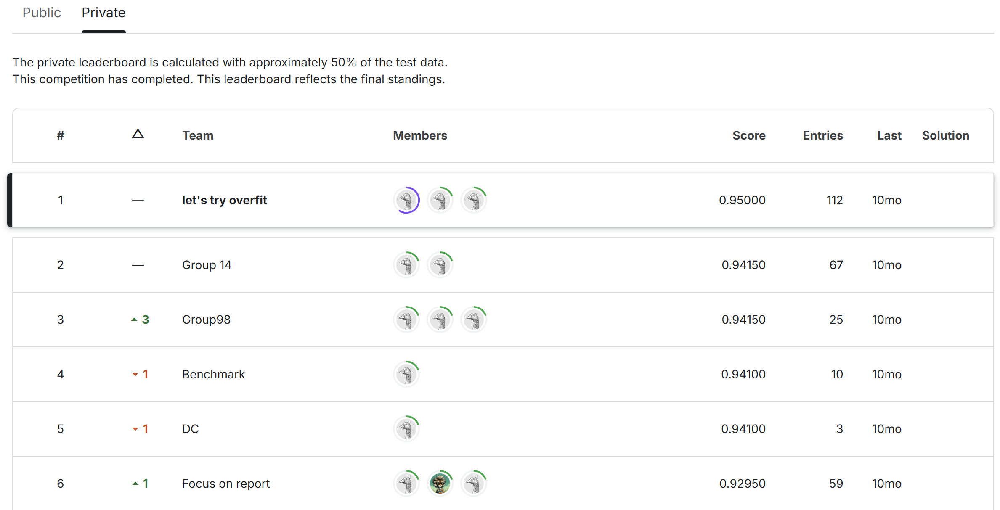

# COMP90051 2024S1 Project 1 — AI-Generated Text Detection

This project focuses on a text classification task: determining whether a given piece of text was written by a human or generated by an AI model. It was conducted as part of an internal Kaggle-style competition for the course **COMP90051 2024S1**.

> 
> 
>   


---

## Table of Contents
- [Overview](#overview)
- [Data Description](#data-description)
- [Approach](#approach)
  - [1. Traditional ML (TF-IDF + Linear Models)](#1-traditional-ml-tf-idf--linear-models)
  - [2. Deep Learning (Transformer + CNN + BiLSTM)](#2-deep-learning-transformer--cnn--bilstm)
  - [3. Domain Prediction and Model Fusion](#3-domain-prediction-and-model-fusion)
- [How to Run](#how-to-run)
  - [1. Installation](#1-installation)
  - [2. Data Preparation](#2-data-preparation)
  - [3. Training and Inference](#3-training-and-inference)
- [Results](#results)
- [Project Highlights](#project-highlights)
- [References](#references)
- [Contact](#contact)

---

## Overview
This project addresses the **AI-Generated Text Detection** problem. We are given:
- **Training Data** from two different domains:
  - **domain1**: Balanced dataset (equal human- and AI-generated samples).
  - **domain2**: Imbalanced dataset (fewer human-written samples, many AI-generated).
- **Test Data**: 4,000 samples (mixed domain1 and domain2), balanced labels but without domain labels provided.

The goal is to build a binary classifier to label each sample as either:
- **0**: AI-generated text  
- **1**: Human-written text

---

## Data Description
- Each sample has a `text` field, which is a list of token IDs after some preprocessing. Token IDs range from 0 to 83582, where `0` is a special placeholder for unknown tokens.
- The training set includes:
  - **domain1.json**: 5,000 samples (2,500 human, 2,500 AI).
  - **domain2.json**: 13,000 samples (1,500 human, 11,500 AI).
- The test set has 4,000 samples (split evenly between human- and AI-generated, and from domain1 and domain2), without labels.

---

## Approach

### 1. Traditional ML (TF-IDF + Linear Models)
1. **Feature Extraction**: Use `TfidfVectorizer` with various n-gram ranges (e.g., 1–7) to capture both short and longer sequences.
2. **Modeling**: Train a linear classifier such as:
   - **SGDClassifier** with different loss functions (`modified_huber`, etc.).
   - **LogisticRegression** to predict domain or final labels.
3. **Imbalanced Data Handling**: Use SMOTE oversampling or class weights to deal with domain2’s label imbalance.

### 2. Deep Learning (Transformer + CNN + BiLSTM)
1. **Embedding & Tokenization**: 
   - Use Keras `TextVectorization` to handle token sequences (up to a certain max length).
   - An `Embedding` layer to learn dense vector representations of tokens.
2. **Transformer Block**: 
   - Implement a custom Keras layer with multi-head attention and feed-forward sub-layers to capture global dependencies.
3. **CNN & Pooling**: 
   - Use `Conv1D` layers to capture local n-gram features.
   - Combine multiple filter sizes or strides, then pool and concatenate.
4. **BiLSTM**: 
   - Stacked on top of CNN outputs to capture sequential patterns in both directions.
5. **Dense & Dropout**: 
   - Final dense layers for classification, with dropout to mitigate overfitting.
6. **Training**:
   - Use callbacks (`ModelCheckpoint`, `EarlyStopping`) to save best models and prevent overfitting.

### 3. Domain Prediction and Model Fusion
1. **Domain Classifier**: A simple logistic regression that predicts whether a sample is from domain1 or domain2 based on TF-IDF features.
2. **Threshold**: If the domain prediction probability is above a certain threshold (e.g., 0.55), we feed the sample into the corresponding deep-learning model (trained on domain1 or domain2).
3. **Fallback to Combined Models**: If the domain probability is uncertain, we combine predictions from:
   - A global model trained on all data.
   - A specialized model trained on domain1 plus domain2’s human samples.

---

## How to Run

### 1. Installation
- Ensure you have **Python 3.8+**.
- Install dependencies via:
  ```bash
  pip install -r requirements.txt
